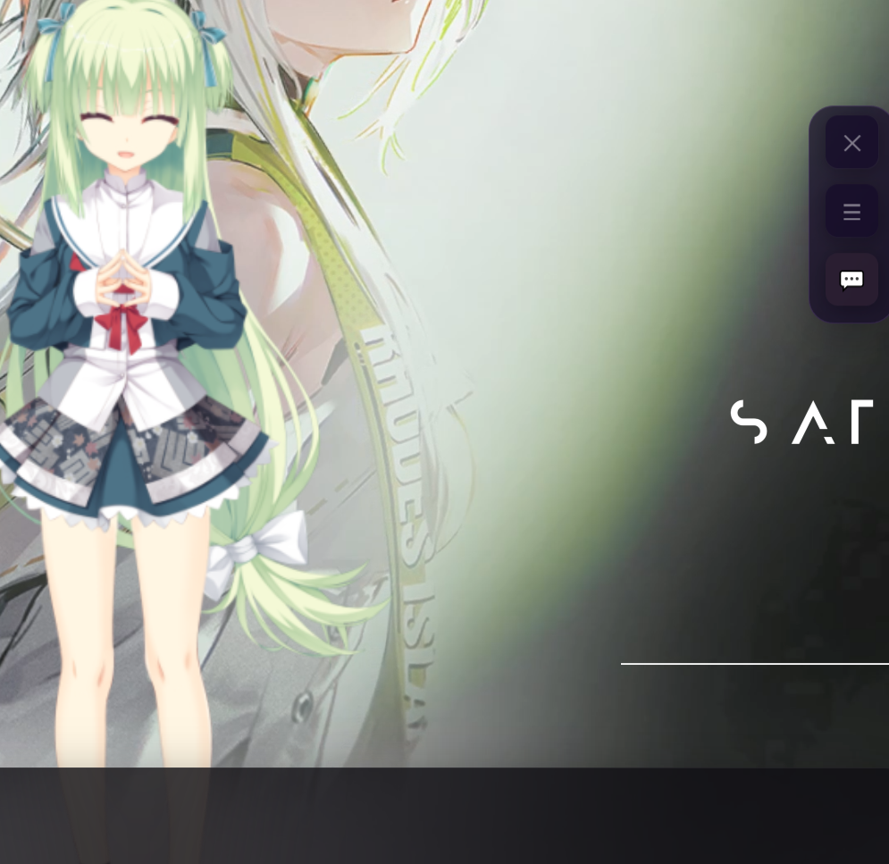

<div align="center">

# 🌸 丛雨 Live2D

### 你的专属 AI 女仆桌面伴侣


*让可爱的丛雨陪伴你的每一天*

</div>

---

## 📸 先看看效果

<div align="center">



*这就是丛雨在你桌面上的样子*

</div>

---

## 🤔 这是什么？

丛雨是一个**桌面虚拟伴侣**，就像一个可爱的二次元女朋友住在你的电脑里：

- 👀 她会**看着你的鼠标**，眼睛跟着移动
- 😊 你**点击她**，她会做出害羞、开心、生气等表情
- 💬 你可以和她**聊天**，她会用 AI 回复你
- 🎙️ 她还能**说话**（需要配置语音功能）

---

## 🎮 怎么和她玩？

### 基本操作（超简单！）

| 你想做什么 | 怎么操作 |
|:---:|:---|
| 💬 聊天 | 点击右上角 💬 按钮，输入文字发送 |
| 🤗 摸摸她 | 用鼠标**左键点击**丛雨的身体 |
| 🔍 放大/缩小 | 用鼠标**滚轮**滚动 |
| 📦 移动窗口 | 用鼠标**右键按住**拖拽 |

### 点她不同部位有不同反应

```
        🎀 头部
        ─────────
        点这里 → 😊 害羞表情 + 摸头
        
        💇 头发  
        ─────────
        点这里 → 😄 开心表情 + 撩发
        
        👗 裙子
        ─────────
        点这里 → 😲 惊讶表情
```

---

## 🚀 安装教程（新手必看！）

### 第一步：下载软件

你有两种下载方式：

#### 方式 A：下载压缩包（推荐新手）

1. 打开 GitHub 页面：[https://github.com/muxier-520/congyu-live2d](https://github.com/muxier-520/congyu-live2d)
2. 点击绿色的 **<> Code** 按钮
3. 选择 **Download ZIP**
4. 下载完成后，**解压**到你喜欢的文件夹

#### 方式 B：用 Git 下载（适合有基础的用户）

打开命令提示符（CMD）或 PowerShell，输入：

```bash
# 下载项目
git clone https://github.com/muxier-520/congyu-live2d.git

# 进入文件夹
cd congyu-live2d
```

---

### 第二步：安装运行环境

> ⚠️ **重要提示**：你需要先安装 Node.js，否则软件无法运行！

1. **下载 Node.js**
   - 打开官网：[https://nodejs.org](https://nodejs.org)
   - 点击 **LTS（长期支持版）** 下载按钮
   - 下载完成后双击安装，一路点 **Next** 即可

2. **验证安装**
   - 按 `Win + R` 键，输入 `cmd`，按回车
   - 在黑色窗口中输入：`node -v`
   - 如果显示版本号（如 `v18.17.0`），说明安装成功 ✅

---

### 第三步：安装软件

1. **打开项目文件夹**
   - 找到你下载/解压的 `congyu-live2d` 文件夹
   - 在文件夹空白处，按住 `Shift` 键，点击鼠标右键
   - 选择 **"在此处打开 PowerShell 窗口"** 或 **"在终端中打开"**

2. **安装依赖**
   - 在打开的窗口中，输入以下命令并按回车：
   ```bash
   npm install
   ```
   - 等待安装完成（可能需要几分钟）

3. **启动软件**
   - 安装完成后，输入：
   ```bash
   npm start
   ```
   - 稍等片刻，丛雨就会出现在你的桌面上啦！

---

## ⚙️ 设置 AI 聊天（让丛雨能说话）

### 前置准备

你需要一个 AI 服务的 API Key（就像账号密码一样）。推荐以下几种：

| 服务商 | 价格 | 新手推荐 |
|:---:|:---:|:---:|
| **DeepSeek** | 💰 便宜 | ⭐⭐⭐ |
| **OpenAI** | 💰💰 中等 | ⭐⭐ |
| **通义千问** | 💰 便宜 | ⭐⭐⭐ |

### 获取 API Key 以 DeepSeek 为例

1. 打开 [https://platform.deepseek.com](https://platform.deepseek.com)
2. 注册账号并登录
3. 点击左侧 **"API Keys"**
4. 点击 **"创建 API Key"**
5. 复制生成的 Key（以 `sk-` 开头的一串字符）

### 在软件中配置

1. 点击丛雨界面右上角的 **⚙️ 齿轮图标**
2. 在「对话程序类型」选择 **☁️ 大模型 API Key**
3. 按照下图填写：

```
┌────────────────────────────────────────────┐
│                                            │
│  API 提供商:  [DeepSeek        ▼]         │
│                                            │
│  API Key:     [sk-xxxxxxxxxxxxxx]          │
│               (粘贴你刚才复制的 Key)        │
│                                            │
│  API 地址:    [自动填充，不用改]            │
│                                            │
│  💾 保存并刷新模型                         │
│                                            │
│  选择模型:    [deepseek-chat   ▼]         │
│                                            │
│           [  保存设置  ]                   │
│                                            │
└────────────────────────────────────────────┘
```

4. 点击 **"💾 保存并刷新模型"**，等几秒
5. 从下拉框中选择一个模型
6. 点击 **"保存设置"**
7. 关闭设置窗口，开始聊天吧！

---

## 🎵 语音功能（可选）

想让丛雨开口说话？需要配置语音合成。

### 最简单的方式：Edge TTS（免费）

1. 电脑需要安装 Python（没有的话去 [python.org](https://python.org) 下载）
2. 打开 PowerShell，输入：
   ```bash
   pip install edge-tts
   ```
3. 在软件设置中启用 TTS 即可

### 高质量方式：GPT-SoVITS

适合想自定义声音的用户，配置较复杂，详见 [GPT-SoVITS 项目](https://github.com/RVC-Boss/GPT-SoVITS)

---

## ❓ 常见问题

### Q: 启动后一片空白/白屏？

**解决方法**：
1. 确认已安装 Node.js
2. 确认在正确的文件夹中运行了 `npm install`
3. 尝试删除 `node_modules` 文件夹，重新运行 `npm install`

### Q: 聊天时显示错误/没有回复？

**解决方法**：
1. 检查 API Key 是否正确（不要有多余空格）
2. 检查网络是否正常
3. 确认 API 余额充足

### Q: 怎么关闭/最小化？

- 点击右上角的 **✕** 关闭
- 点击 **─** 最小化到任务栏

### Q: 丛雨挡住我工作了怎么办？

- 用**右键拖拽**可以移动窗口位置
- 或者在设置中调整模型大小

---

## 📁 文件说明（给想研究的朋友）

```
congyu-live2d/
│
├── electron/          ← 程序启动相关（不用管）
├── js/                ← 核心代码
│   ├── app.js        ← 主要功能
│   └── ...
├── css/               ← 界面样式
├── models/            ← 丛雨的模型文件
├── services/          ← AI、语音等服务
├── index.html         ← 界面文件
└── package.json       ← 项目配置
```

---

## 💬 感谢使用

如果这个项目对你有帮助，欢迎：

- ⭐ 给个 Star 鼓励一下
- 🐛 发现 Bug 请提 Issue
- 💡 有好建议欢迎 Pull Request

---

<div align="center">

**享受和丛雨的每一天吧！** 🌸

Made with ❤️ by [muxier-520](https://github.com/muxier-520)

</div>
